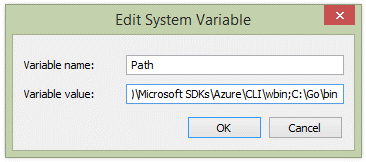
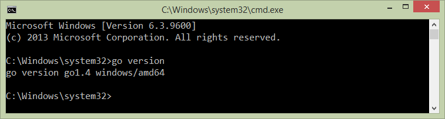
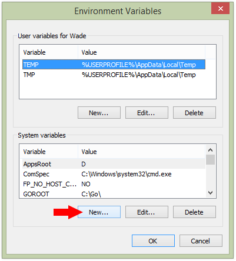
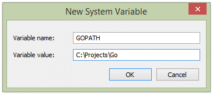
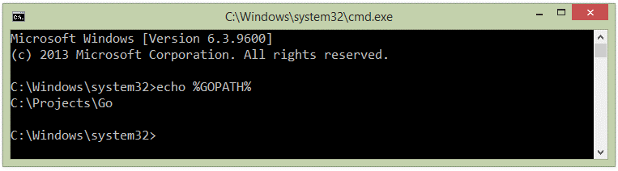

# GOLANG 

## Table of Contents

<details>
<summary>Click to expand</summary>

  - [Name Of The Language](#name-of-the-language)
  - [Authors](#authors)
  - [Why Was It Invented](#why-was-it-invented)
  - [Why Should You Use Golang](#why-should-you-use-golang)
  - [GO PROGRAMMING SETUP](#go-programming-setup)
    - [Windows](#windows)
    - [Linux(Ubuntu)](#linux(ubuntu))
    - [Mac](#mac)
  - [Functional Programming](#functional-programming)
  - [Functional Programming Paradigms In Go](#functional-programming-paradigms-in-go)
  - [Example Codes](#example-codes)
  - [Work Sharing](#work-sharing)

</details>

## Name Of The Language

The language is called Go. The "golang" moniker arose because the web site is golang.org, because go.org was not available to them. Many use the golang name, though, and it is handy as a label. For instance, the Twitter tag for the language is "#golang".

## Authors

Robert Griesemer, Rob Pike and Ken Thompson started to make new language on September 21, 2007. By January 2008, Ken had started work on a compiler. It generated C code as its output. In May 2008, Ian Taylor independently started on a GCC front end for Go using the draft specification. Russ Cox joined in late 2008 and helped move the language and libraries from prototype to reality.
Go became a public open source project on November 10, 2009. So everyone can be author of go right now.

## Why was it invented

Go was born out of frustration with existing languages and environments for the work they were doing at Google. They think programming had become too difficult and the choice of languages was partly to blame. Programming languages force us to choose either efficient compilation, efficient execution, or ease of programming. All three were not available in the same mainstream language. Programmers who could were choosing ease over safety and efficiency by moving to dynamically typed languages such as Python and JavaScript rather than C++ or, to a lesser extent, Java.

Go addressed these issues by attempting to combine the ease of programming of an interpreted, dynamically typed language with the efficiency and safety of a statically typed, compiled language. It also aimed to be modern, with support for networked and multicore computing. working with Go is intended to be fast: it should take at most a few seconds to build a large executable on a single computer. To meet these goals required addressing a number of linguistic issues: an expressive but lightweight type system; concurrency and garbage collection; rigid dependency specification; and so on. These cannot be addressed well by libraries or tools; a new language was called for.


## Why should you use golang?

- Fast-paving compilation and execution
- Do away with the need of working with different subsets of languages for one project.
- A boost to code readability and documentation
- Offering a thoroughly consistent language
- Facilitating easy versioning of the program
- Allowing developing with multiple languages
- Allowing easier maintenance of dependencies
- Go used channel based concurrency model
- Golang is very simple to learn and use
- It is a very good option to create things in a short time.
- It is a compiled language, and whatever you wanna make, it comes out as a single executable file.

## GO PROGRAMMING SETUP

 - ### WINDOWS

  1.	Download and install the latest 64-bit Go MSI distributable (which sets most of the environmental variables for you). https://golang.org/dl/

  2.	Ensure the Go binaries (found in C:\Go\bin) are in your Path system environment variables. To check click System, Advanced system settings, Environment Variables… and open Path under System variables:
   

  An easy way to confirm is to open the command line and type go version:
  


  3.	Setup your Go workspace. This consists of three folders at the root:
  - src
  - pkg
  - bin


  4.	Create the GOPATH environment variable and reference your Go workspace path. To add, click System, Advanced system settings, Environment Variables… and click New…   under System variables:
  

  Set the variable name to GOPATH and value to your Go workspace path (e.g. C:\Projects\Go):

  

  You can quickly check to ensure your path has been set by opening the command line and typing echo ```%GOPATH% ``` and check the output:
  

  - ## Linux(ubuntu)
  
    1. Install Go on Ubuntu
      Login to your Ubuntu system using ssh and upgrade to apply latest security updates there.
        ```bash
        sudo apt-get update
        sudo apt-get -y upgrade
        ```
        
        Now download the Go language binary archive file using following link. To find and download latest version available or 32 bit version go to official download page.
        ```bash
        wget https://dl.google.com/go/go1.13.3.linux-amd64.tar.gz
        ```
        Now extract the downloaded archive and install it to the desired location on the system. For this tutorial, I am installing it under /usr/local directory. You can also put this under the home directory (for shared hosting) or other location.

        ```bash
        sudo tar -xvf go1.13.3.linux-amd64.tar.gz
        sudo mv go /usr/local
        ```

   2. Setup Go Environment
   
      Now you need to setup Go language environment variables for your project. Commonly you need to set 3 environment variables as GOROOT, GOPATH and PATH.

      GOROOT is the location where Go package is installed on your system.

      ```bash
      export GOROOT=/usr/local/go
      ```
      GOPATH is the location of your work directory. For example my project       directory is ~/Projects/Proj1 .
      ```bash
      export GOPATH=$HOME/Projects/Proj1
      ```
      Now set the PATH variable to access go binary system wide.

      ```bash
      export PATH=$GOPATH/bin:$GOROOT/bin:$PATH
      ```
      All the above environment will be set for your current session only. To make it permanent add above commands in ~/.profile file.

   3. Verify Installation

      At this step, you have successfully installed and configured go language on your system. First, use the following command to check the Go version.

      ```bash
      go version
      go version go1.13.3 linux/amd64
      ```


 - ## MAC

    1. Download and Install
          ```bash
          curl -o go.pkg https://dl.google.com/go/go1.14.1.darwin-amd64.pkg

          shasum -a 256 go.pkg | grep 29ac3bd40c1923df12efdc0cd78543746819a10c1a19eb4feb23d46ec77386d1
          
          sudo open go.pkg
          rm go.pkg
          
          ```
        If the second command doesn’t print the sha256 string back then something is not right :-)
        You can get the link to the current installation package from https://golang.org/dl/ . It’s also where you can get the sha256 checksum for the installer.

    2. Setup Your  Go Workspace

          The default (global) workspace for Go is ``$HOME/go`` If you want to use another location set the ``$GOPATH`` variable explicitly in you ``.profile`` file (or its equivalent). Go 1.11 introduced the initial support for modules where you no longer have to rely on ``$GOPATH``. With Go 1.14 Go modules are finally ready for production and they are no longer an experimental feature. See the official Go Modules wiki and blog posts to learn more about using modules. Use Go Modules unless you have a specific reason not to use them and if you do then you don’t need to worry about ``$GOPATH`` and where you put your project.
          As a best practice you should also add the bin directory from your workspace to your PATH(in your .profile file).
          ```
          export PATH=$PATH:$GOPATH/bin
          ```

## FUNCTIONAL PROGRAMMING 

  “Functional programming is a programming paradigm that treats computation as the evaluation of mathematical functions and avoids state and mutable data”. In other words, functional programming promotes code with no side effects, no change of value in variables. It opposes imperative programming, which empathizes change of state”. 

  What does this mean? 
  - No mutable data (no side effect). 
  - No state (no implicit, hidden state). 
  - Once assigned (value binding), a variable (a symbol) does not change its value.

## Functional Programming paradigms in GO

  - ### No Mutation
    Creat data instead of updating.
    ```go
    // Wrong!
    name := “Geison”
    name := name + “ Flores” // Mutations is now allow in FP

    // Rigt!
    const firstname = “Geison”
    const lasname = “Flores”
    const name = firstname + “ “ + lastname
    ``` 

  - ### Higher Order Functions
    Functions and methods are first-class objects in Golang, so if you want to pass a function to another function, you can just treat it like any other object.

    ```go
    func caller(f func(string) string) {
    result := f(“David”)
    fmt.Println(result)
    }
    f := func(s name) string {
        return “Hello “ + name
    }
    caller(f)
    ```
  - ### Closure
    ```go
    func add_x(x int) func(z int) int {
      return func(y int) int { // anonymous function
          return x + y
      }
    }
    add_5 := add_x(5)
    add_7 := add_x(7)
    add_5(10) // result 15
    add_7(10) // result 17
    ```
  - ### Currying
    Higher-order functions enable Currying, which the ability to take a function that accepts n parameters and turns it into a composition of n functions each of them takes 1 parameter. Direct use of currying is the Partial Functions where if you have a function that accepts n parameters then you can generate from it one or more functions with some parameter values already filled in.
  
    ```go
    func plus(x, y int) int {
      return x + y
    }
    func partialPlus(x int) func(int) int {
        return func(y int) int {
            return plus(x, y)
        }
    }
    func main() {
        plus_one := partialPlus(1)
        fmt.Println(plus_one(5)) //prints 6
    }
    ```

## Example Codes
  ```go 
  problemloop:
    for i, p := range randomProblems {
      // Print question.
      fmt.Printf("Problem #%d: %s = ", i+1, p.q)
      // Creating channel that takes string
      answerCh := make(chan string)
      // Taking answer from player using goroutine
      go func() {
        var answer string
        fmt.Scanf("%s\n", &answer)
        // Pass answer to the channel
        answerCh <- answer
      }()

      // Wait for the answer or times running out
      select {
        // if times done game is over
      case <-timer.C:
        break problemloop
        // if answer before times done
      case answer := <-answerCh:
          // Check if it is correct or not
        if answer == p.a {
          // If correct add a point
          correct++
        }
      }
    }
    fmt.Printf("You scored %d out of %d.\n", correct, len(problems))
  }
  ```

## Work Sharing
Kenan Abbak
- Name Of The Language
- Authors
- Why was it invented?
- Go Programming Setup(Windows)
- Example Codes

Ahmetcan Özcan
- Why Should You Use Golang?
- Go Programming Setup(Linux)
- Go Programming Setup(Mac)
- Functional Programming
- Functional Programming Paradigms In Go
 
